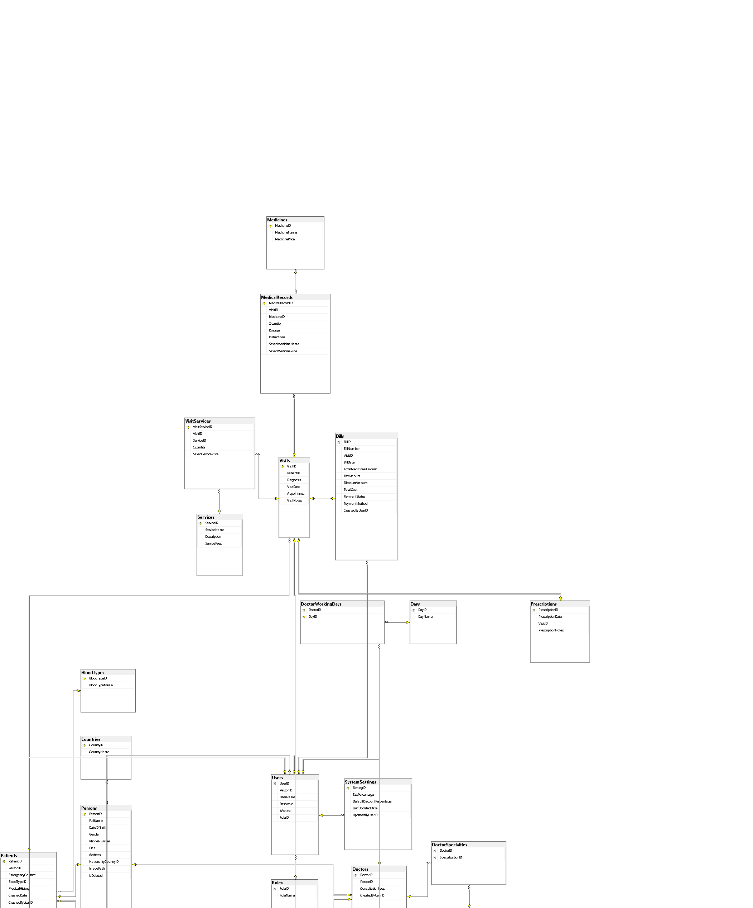
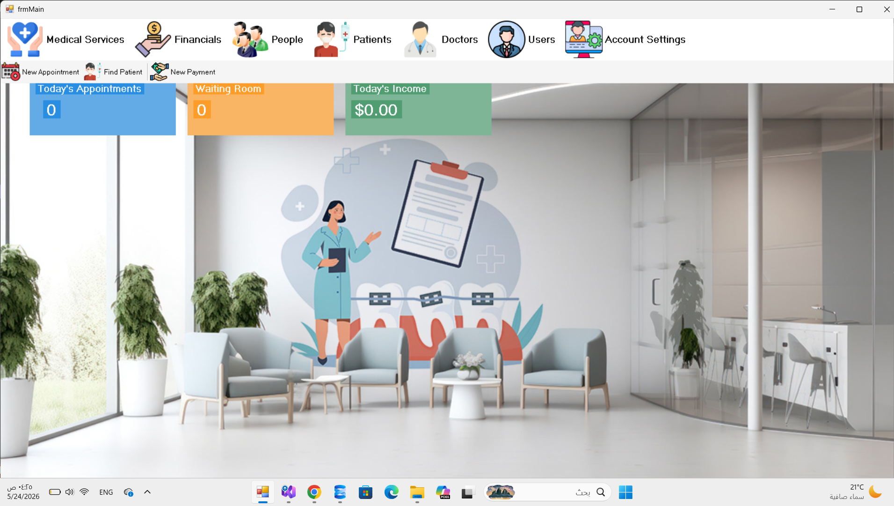

# Clinic Management System 🏥

نظام إدارة عيادة طبية متكامل ومحكم، مبني بمعمارية الطبقات الثلاث (**3-Tier Architecture**) لضمان الفصل التام بين منطق العمل، الوصول للبيانات، وواجهة المستخدم، مما يجعله نظاماً قابلاً للتوسع، الصيانة، والاختبار. يهدف النظام إلى أتمتة العمليات الطبية، وإدارة شؤون المرضى، والأطباء، والمستخدمين بكفاءة عالية وأمان فائق.

---

## 🏗️ هندسة النظام (System Architecture)
يعتمد المشروع على توزيع المهام وفقاً للمسارات التالية:

* **1. Presentation Layer (`/Clinic`):** الطبقة المسؤولة عن التفاعل مع المستخدم النهائي، تحتوي على نماذج (`WinForms`) وعناصر تحكم مخصصة (`User Controls`).
* **2. Business Logic Layer (`/Clinic_Business`):** قلب النظام، حيث يتم تطبيق قواعد العمل الصارمة (`Business Rules`) والتحقق التلقائي من صحة البيانات.
* **3. Data Access Layer (`/Clinic_DataAccess`):** الطبقة المسؤولة عن التواصل المباشر مع **SQL Server** باستخدام `Stored Procedures` لضمان السرعة والأمان التام ضد الحقن البرمجي.

---

## 📂 هيكلية المشروع (Project Tree)
```text
Clinic_System/
├── Clinic/                # Presentation Layer (Forms & Controls)
│   ├── Patient/           # Patient Management Modules
│   ├── Person/            # Person Management Modules
│   ├── User/              # User Management & Security
│   └── global classes/    # Utility & Helper Classes
├── Clinic_Business/       # Business Logic Layer (Business Objects)
├── Clinic_DataAccess/     # Data Access Layer (DB Interactions)
└── Image/                 # Project Screenshots & DB Schema

```

## 🏗️ هيكلية قاعدة البيانات (Database Diagram)
هذا المخطط يوضح العلاقات بين الجداول المختلفة في قاعدة بيانات العيادة (`ClinicDB`):


## 📅 التحديثات والميزات (Module Showcase)

### 👥 إدارة الأشخاص (Person Management)
نظام مركزي لإدارة بيانات الأشخاص (مرضى، أطباء، مستخدمين).

| الشاشة | اللقطة |
| :--- | :--- |
| **قائمة الأشخاص** |  |
| **إضافة/تعديل شخص** |  |
| **تفاصيل الشخص** |  |

---

### 🩺 إدارة المرضى (Patient Management)
إدارة كاملة للملفات الطبية للمرضى مع حماية ضد التكرار وتحقق من صحة البيانات.

| الشاشة | اللقطة |
| :--- | :--- |
| **قائمة المرضى** |  |
| **إضافة/تعديل مريض** |  |
| **تفاصيل المريض** |  |
| **بحث عن المريض** |  |

---

### 🔑 إدارة المستخدمين (User Management)
تحكم كامل بصلاحيات الدخول وحماية الحسابات.

| الشاشة | اللقطة |
| :--- | :--- |
| **قائمة المستخدمين** |  |
| **إضافة/تعديل مستخدم** |  |
| **تغيير كلمة المرور** |  |

---

## 🖥️ الواجهة الرئيسية (Dashboard)
المركز العصبي للنظام الذي يربط كافة الأقسام.



---

## 🛠️ التقنيات المستخدمة
* **اللغة:** C# (.NET Framework)
* **قاعدة البيانات:** Microsoft SQL Server
* **نمط التصميم:** 3-Tier Architecture / Vertical Slicing
* **إدارة المستودع:** Git

---

## 🚀 كيفية التشغيل
1. قم بعمل `Clone` للمستودع:
   ```bash
   git clone [https://github.com/your-username/Clinic_System.git](https://github.com/your-username/Clinic_System.git)