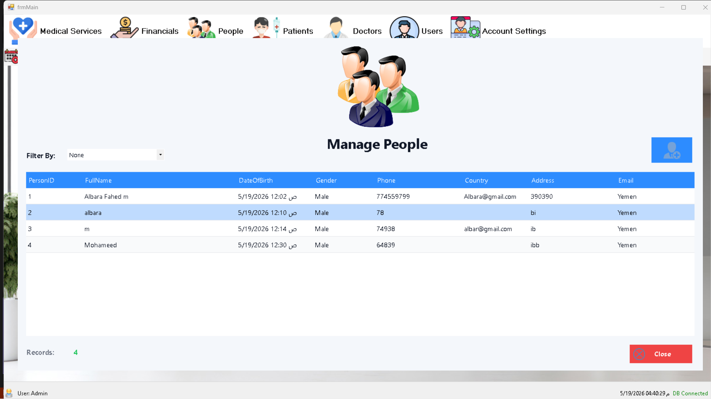
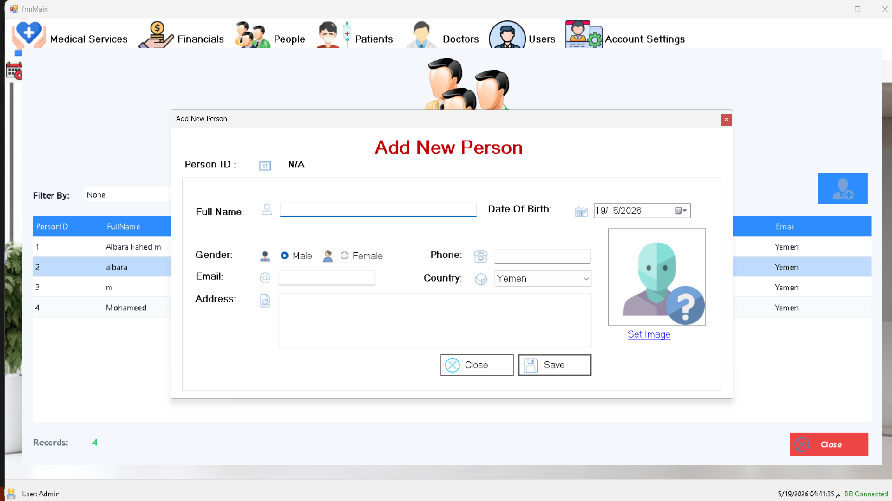
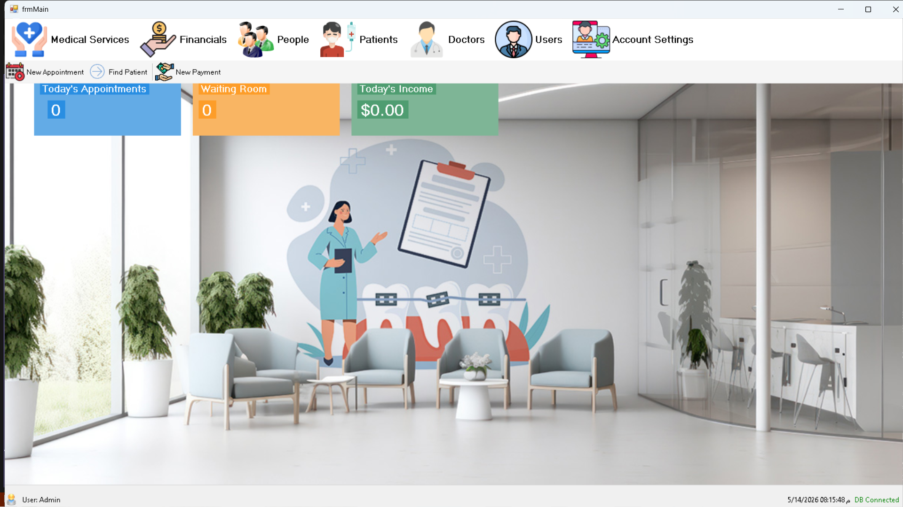

# Clinic Management System 🏥

نظام إدارة عيادة طبية متكامل ومحكم مبني باستخدام لغة **C# WinForms** واعتماد معمارية الطبقات الثلاث (**3-Tier Architecture**) الرصينة. يهدف النظام إلى أتمتة العمليات الطبية، وإدارة شؤون المرضى، والأطباء، والمواعيد بكفاءة عالية وأمان فائق.

---

## 🏗️ البنية المعمارية وهندسة النظام (Architecture & Code Quality)

تم بناء النظام بالكامل وفق المعايير البرمجية للشركات الكبرى لضمان القابلية للتوسع (Scalability) وسهولة الصيانة، مع عزل كامل لكل طبقة:
- **Presentation Layer (Clinic_Presentation):** واجهات المستخدم المستقرة والتفاعلية بالاعتماد على نموذج التصميم المسطح والأيقونات المعبرة.
- **Business Logic Layer (Clinic_Business):** إدارة الكائنات وتطبيق قواعد العمل الصارمة (Business Rules) والتحقق التلقائي من صحة البيانات (Validation).
- **Data Access Layer (Clinic_DataAccess):** التعامل مع قاعدة البيانات (SQL Server) باستخدام **Stored Procedures** حصرياً لتوفير أقصى درجات السرعة والحماية التامة ضد ثغرات الاختراق (SQL Injection).

---

## 📅 التحديثات البرمجية والميزات الحالية (Features & Updates)

### 👥 ميزة إدارة الأشخاص (Person Management Feature) - [2026-05-19]
تم الانتهاء من تطبيق الهيكلية العمودية الكاملة (Vertical Slicing) لإدارة البيانات الأساسية للأشخاص في النظام (مرضى، أطباء، مستخدمين):

#### 📸 شاشة استعراض وقائمة الأشخاص (Manage People)
واجهة متطورة لعرض السجلات البرمجية مع دعم التصفية الذكية والتحميل السلس للبيانات لضمان عدم تجمد الواجهة (Anti-Flickering & Double Buffering).


#### 📸 شاشة إضافة وتحديث بيانات شخص (Add/Update Person)
نموذج إدخال تفاعلي مدمج بـ `ErrorProvider` للتحقق الفوري من المدخلات، مع تخصيص ذكي لخيارات الجنس (Gender) والبلد والاتصال، ودعم رفع الصور الشخصية ديناميكياً وحفظ مساراتها خارجياً لحفظ أداء قاعدة البيانات.


---

### 💻 شاشة القائمة الرئيسية (Main Dashboard) - [2026-05-14]
الواجهة الأساسية للنظام لتوفير تجربة مستخدم سلسة واحترافية للوصول السريع لكافة أقسام العيادة.

#### ✨ المميزات:
- **القائمة الرئيسية (MenuStrip):** تنظيم الوصول إلى الخدمات الطبية، المرضى، الأطباء، والمستخدمين بأيقونات عالية الجودة.
- **شريط الوصول السريع (Quick Access):** أزرار مباشرة لإضافة موعد جديد أو تسجيل دفع مالي.
- **لوحة الإحصائيات (Live Stats Cards):** عرض فوري لعدد مواعيد اليوم، غرفة الانتظار، والدخل اليومي.
- **شريط الحالة (Status Strip):** يعرض المستخدم الحالي، حالة الاتصال الفورية بقاعدة البيانات (DB Connected)، والوقت الفوري.

#### 📸 لقطة من الشاشة (Screenshot)


---

## 🛠️ التقنيات المستخدمة (Tech Stack)

- **لغة البرمجة:** C# (Object-Oriented Programming)
- **الإطار:** .NET WinForms / .NET Framework
- **قاعدة البيانات:** Microsoft SQL Server (Stored Procedures, Non-Clustered Indexing)
- **إدارة الشفرة:** Git/GitHub (Feature-Driven Workflow / Vertical Slicing)
- **التصميم:** Custom UI Components, Translucent Panels & Flat Icon Design الهوية البصرية الموحدة.

---

## 🚀 كيفية التشغيل والتهيئة (Setup & Installation)

1. قم بعمل `Clone` للمستودع عبر الأمر التالي:
   ```bash
   git clone [https://github.com/your-username/Clinic_System.git](https://github.com/your-username/Clinic_System.git)